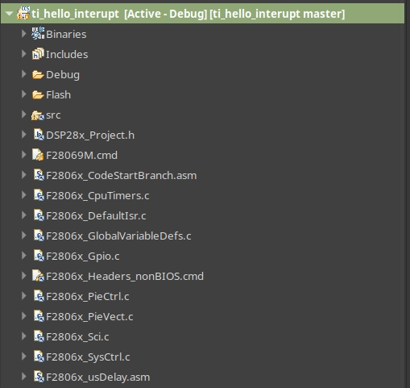
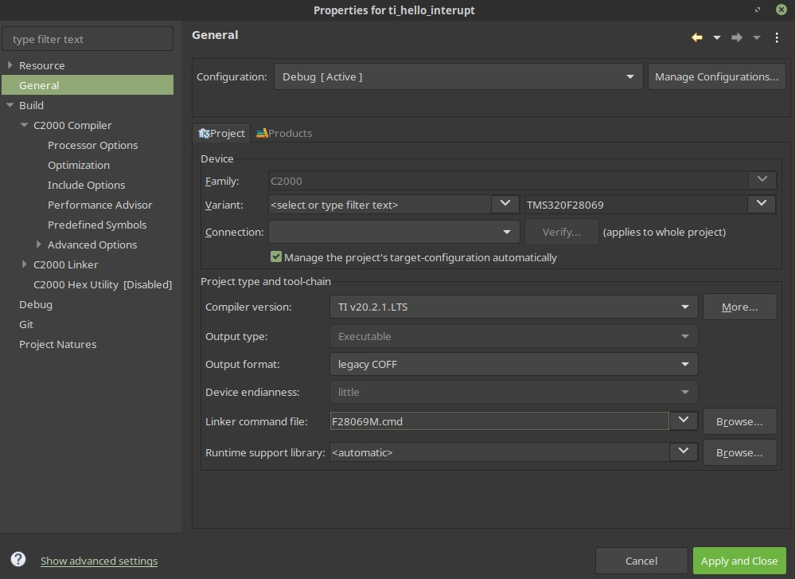

# TI Launchpad F28069M interrupt hello world example

Import the css folder. The result should be like the bottom image:

The files outside of src folder should be linked from C2000Ware package.

Example: *~/ti/C2000Ware_3_01_00_00_Software/device_support/f2806x/common/include*

Remember also to link the linker file:

Example *~/ti/C2000Ware_3_01_00_00_Software/device_support/f2806x/common/cmd*
